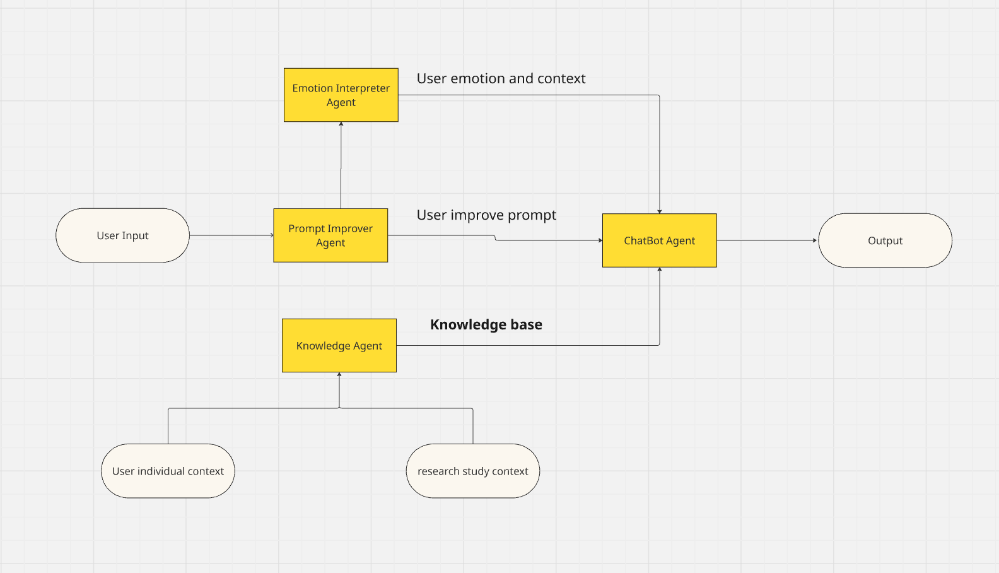

# Paliative care chat bot Prototype:
## Abstract:
- The main goal of this project is to develop a prototype of a chatbot designed to support family members and informal caregivers when palliative care professionals are not available to provide assistance.

- To train and inform the chatbot, we will use clinical case studies, general knowledge about palliative care, and specific information about the patient being cared for by the family or informal caregiver. The quality and reliability of these information sources are crucial to ensure accurate and meaningful responses, and to minimize the risk of hallucinations (i.e., the model generating false or unsupported information).

## Agent Workflow

- ## Prompt Improver Agent
  This agent is responsible for improving the user’s prompt to ensure that the input is clear, concise, and free of redundant information. Its goal is to make the queries more consistent so that the chatbot can generate better responses.

- ## Emotion Interpreter Agent

  ### Purpose
  This agent analyzes the user's **emotion**, **context**, and **level of distress**.  
  Depending on the emotional state, the chatbot dynamically adapts its **response style**:

  - **Stressful situations (high distress):**  
    The chatbot should respond **clearly and directly**, avoiding long or complex explanations.  
  - **Calm situations (low distress):**  
    The chatbot can offer **more detailed and informative** responses.

  ---

  ### Context Prompt
  Represents the family's **emotional intensity or level of distress** on a scale from **1 to 10**:

  | Level | Description | Chatbot Behavior |
  |:------:|--------------|------------------|
  | **1–3** | Calm or curious — the family is simply seeking information. | Provide friendly, detailed, and educational answers. |
  | **4–7** | Concerned or anxious — the family needs reassurance and clear guidance. | Be concise but empathetic, offering clear next steps. |
  | **8–10** | Urgent or desperate — the family is emotionally overwhelmed. | Provide short, direct, and comforting responses. |

  ---

  ### Usage Examples
  | Test | Input Sentence | Classified Emotion (1–10) | Interpretation |
  |:----:|----------------|:--------------------------:|----------------|
  | **1** | _"Sinto-me muito em baixo, a saúde da minha mãe piorou."_ | **9** | Deep sadness and despair; needs emotional support. |
  | **2** | _"Estou um pouco preocupado com a situação, mas acho que vai correr tudo bem."_ | **5** | Moderate concern with optimism; balanced tone. |
  | **3** | _"Estou preocupado com a dor que a minha mãe está a sentir."_ | **6** | Noticeable distress; seeking reassurance. |
  | **4** | _"Porque é que nada parece funcionar direito aqui?"_ | **9** | High frustration and emotional tension. |
  | **5** | _"Bom dia, gostaria de saber o estado clínico da minha mãe."_ | **2** | Calm, neutral inquiry; low emotional intensity. |
  | **6** | _"Estou um pouco preocupado, a minha mãe não tem comido bem."_ | **6** | Mild to moderate concern. |
  | **7** | _"Ela parece pior hoje, mas talvez seja só cansaço."_ | **6** | Concern mixed with cautious optimism. |
  | **8** | _"Já não sei o que fazer, isto tem sido muito difícil."_ | **9** | Emotional exhaustion and helplessness. |

  ---

- **Knowledge Agent**  
  This agent summarizes and indexes all background information, providing a **scientific and evidence-based foundation** for the chatbot. It organizes:  
  - Generic palliative care knowledge  
  - Patient-specific information

- ## ChatBot Agent
  This agent receives the improved prompt, the emotional context, and the relevant knowledge from the Knowledge Agent to generate **precise and helpful responses**, adapting to the user’s emotional and situational context.
    ### Context Prompt
     ```python
      system",
      "You are a palliative care chatbot assisting families caring for a patient at home. "
      "You receive three contexts:\n"
      "1) Theoretical knowledge: general palliative care guidelines.\n"
      "2) Patient-specific info: details about the patient.\n"
      "3) Emotional context: family stress level (1-10).\n\n"
      "Instructions:\n"
      "- Base your answers primarily on the theoretical context.\n"
      "- Do NOT repeat patient-specific info unnecessarily.\n"
      "- Adjust your response based on emotional context:\n"
      "    * 8-10: family is in distress/desperate – give **direct, concise recommendations**, avoid long explanations.\n"
      "    * 4-7: family is somewhat anxious – give **clear guidance with moderate explanation**.\n"
      "    * 1-3: family is calm – you may give **more detailed and descriptive answers**.\n"
      "- Prioritize user questions, provide actionable steps first, then optional elaboration if emotional context allows.\n\n"
      "Theoretical knowledge: {theoretical_context}\n"
      "Patient-specific info: {individual_context}\n"
      "Emotional context: {emotional_context}\n"
      ),
      MessagesPlaceholder(variable_name="messages"),
      ])
```



### Adition agents (future work)
- **Feedback Agent**  
  This agent is responsible for **evaluating the chatbot’s output**. It checks whether the generated response is appropriate, accurate, and helpful, providing feedback to improve or refine the final output if necessary.
